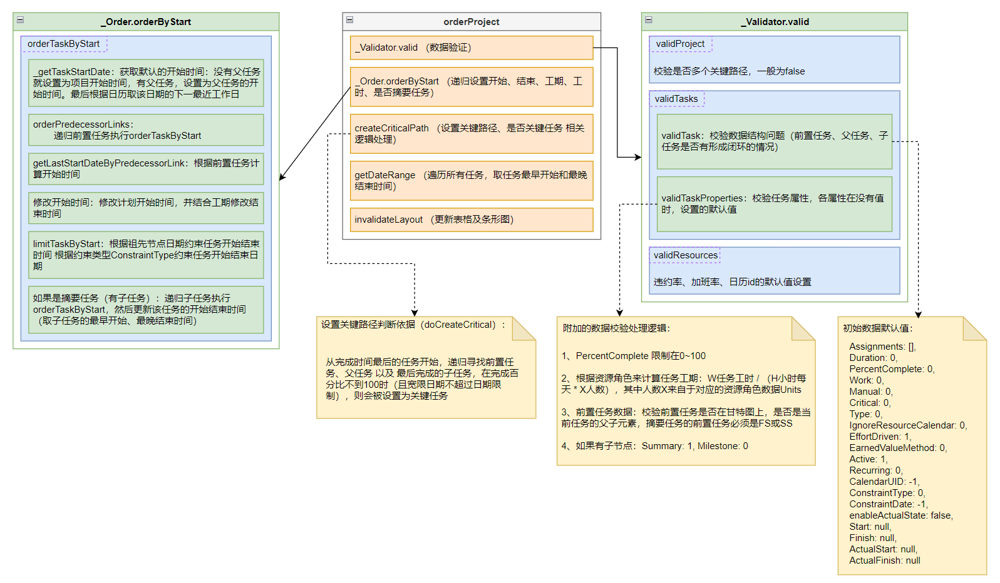

# 一、甘特图自动计算逻辑分析

> 甘特图在初始化以及用户手动编辑后，会进行部分业务逻辑相关的计算赋值处理，本章主要就其自动计算代码逻辑进行解析，便于理解甘特图的数据处理过程


## 1.  甘特图自动排程方法（orderProject）

> 甘特图自动排程方法（orderProject），初始化计算以及手动编辑场景都会调用此方法，完成诸如开始、结束日期调整、关键路径计算、初始数据调整、调用条形图渲染等处理

### 


## 2. 手动编辑计算处理（updateTask）

> 手动编辑涉及到的场景及方法比较多，包含了上移、下移、升级、降级、移除、回滚等诸多场景：
>
> moveTask、moveTasks、removeTask、removeTasks
> upgradeTask、downgradeTask、removeLink、addLink、setLinks
> endOrder、schedule、moveProject、setCalendars、setCalendarUID、setResources
> restore

这里重点讲一下`updateTask`，该方法是大多数手动编辑场景的核心方法

```javascript
updateTask: function (task, field, value) {
	// ...
    
    if (typeof field == 'object') {
        this._updateTask(task, field);
        return;
    }
    
    // ...
    
    switch (field) {
        case 'Work':
            value = parseFloat(value);
            this.store.updateRecord(task, field, value);
            this._updateTaskWork(task);
            this.store.updateRecord(task, 'Milestone', task.Duration == 0 ? 1 : 0);
            this.orderProject();
        case 'Start':
            // ...
            this.orderProject();
        case 'Finsh':
            // ...
            this.orderProject();
    }
}
```

几乎所有甘特图使用的字段修改都会触发该方法，包括条形图编辑。大多数编辑操作后，会执行`this.orderProject()`，这个其实就是上一节提到甘特图自动排程方法（orderProject）。


## 3. 表格与条形图渲染

> 无论是初始自动排程计算，还是手动编辑触发计算，最终都要进行渲染更新，大多数操作都是通过orderProject来调动渲染更新方法（invalidateLayout），该方法本质上是调用doLayout -> refresh -> refreshBody、refreshHeader，但是做了防抖处理，避免同一时间内存在多个渲染处理。

```javascript
invalidateLayout: function () {
    var me = this;
    if (!me._layoutTimeout) {
        me._layoutTimeout = mini.defer(function () {
            me.doLayout();
        });
    }
},
doLayout: function () {
    if (!this.el) return;

    if (this._refreshTimeout) {
        this.refresh();
    }

    if (this._layoutTimeout) {
        mini.clearTimeout(this._layoutTimeout);
        this._layoutTimeout = null;
    }

    doLayout.call(this);
},
refresh: function () {
    this._lastViewRegion = this.updateViewRegion();

    this.refreshHeader();
    this.refreshBody();
}
```

表格渲染和条形图渲染的核心处理方法为各自实例上的`refreshBody`以及`refreshHeader`方法，可以在`miniui.js`中搜索，进行相关代码阅读

### 3.1 PPM 甘特图初始化渲染分析

现在，就PPM对于甘特图的使用，分析PPM甘特图初始化时，依次所触发的渲染更新处理：

| #    | 操作                                      | 表格渲染（次） | 条形图渲染（次） | 备注                                                         |
| ---- | ----------------------------------------- | -------------- | ---------------- | ------------------------------------------------------------ |
| 1    | new PlusProject                           | 1              | 1                | 由于此时还没有列数据、行数据，所以做的计算量很少             |
| 2    | setStyle、render、loadData、acceptChanges | 1              | 1                | 这几个方法同步进行，且都会触发表格和条形图的渲染，但由于有防抖处理，所以只会触发1次 |
| 3    | setColumns                                | 1              | 0                | 在异步获取到列信息后，触发了表格的渲染更新                   |

目前来看，PPM的甘特图初始化渲染调用虽然次数多，但是其中几次是在没有列数据或行数据的情况下渲染的，所做的计算量并不会太大。
