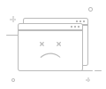

# 平台静态资源包

| 资源名称       | 包内路径                     |                               | 应用场景                  | 说明        |
|------------|--------------------------|-------------------------------|-----------------------|-----------|
| 公司 Logo    | `images/logo.svg`        |         | 1. 系统信息面板 2. 登录页面 | 最佳比例参考原文件 |
| 页头Logo-小版本 | `images/logo1-min.svg`   |    | 页头Logo                | 最佳比例参考原文件 |
| 默认应用图标     | `images/default.ico`     |      | 左上角应用抽屉               | 1:1       |
| 应用抽屉       | `images/application.svg` |  | 左上角应用抽屉入口             | 1:1       |
| 空内容占位      | `images/empty.svg`       |        | 所有空内容区域               |           |
| 404        | `images/404.svg`         |          | 404                   |           |
| 403        | `images/403.svg`         |          | 403                   |           |
| 即将上线       | `images/comingSoon.svg`  |   | 即将上线                  |           |
| AD域背景      | `images/AD.svg`          |           | 登录页面                  |           |
| ER登录按钮     | `images/ER.svg`          |           | 登录页面                  |           |
| AD登录按钮     | `images/ldap.svg`        |         | 登录页面                  |           |
| 租户图标       | `images/tenantry.svg`    |     | 登录页面                  |           |

